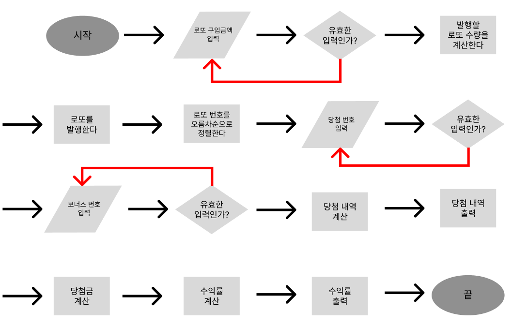

## 프로그래밍 목표

1. Java Enum 적용
2. View를 제외하고 단위 테스트 적용
3. 팩토리 메서드 적용

## 기능 구현 목표

### Flow

### 세부 기능

0. 모든 에러는 `[ERROR]`로 시작한다.
1. 로또 구입 금액을 입력 받는다
    - [x]  1이상 2147483647 (integer 최댓값)이하인지 확인한다.
    - [x]  로또 금액 (현재 기준 1,000원) 으로 나누어 떨어지지 않는다면 IllegalArgumentException을 반환한다.
2. 발행할 로또 수량을 계산한다.
    - [x]  `로또 구입 금액 / 로또 금액 (현재 기준 1,000원)`의 결과를 발행한 로또 수량으로 계산한다.
3. 로또 수량만큼 로또 번호를 발행한다.
    - [x]  `Randoms.pickUniqueNumbersInRange`를 사용하여 6개의 로또 번호 숫자 범위 (현재 기준 1 ~ 45) 내의 숫자를 로또 수량만큼 생성한다.
    - [x]  오름차순으로 정렬하여 로또들을 저장한다.
4. 당첨 번호를 입력받는다.
    - [ ]  delimiter (현재 기준 ',') 기준으로 입력 받은 당첨 번호를 구분한다.
    - [x]  6개로 구분되지 않는다면 IllegalArgumentException을 반환한다.
    - [ ]  숫자가 아니라면 IllegalArgumentException을 반환한다.
    - [x]  입력 받은 당첨 번호가 로또 번호 숫자 범위 (현재 기준 1 ~ 45) 내인지 확인한다. 범위 밖이라면 IllegalArgumentException을 반환한다.
    - [x]  입력 받은 당첨 번호가 중복되지 않는지 확인한다. 중복된다면 IllegalArgumentException을 반환한다.
5. 보너스 번호를 입력받는다.
    - [ ]  보너스 번호가 로또 번호 숫자 범위 (현재 기준 1 ~ 45) 내인지 확인한다. 범위 밖이라면 IllegalArgumentException을 반환한다.
    - [ ]  보너스 번호가 입력 받은 당첨 번호와 중복되지 않는지 확인한다. 중복된다면 IllegalArgumentException을 반환한다.
6. 당첨 내역을 계산한다.
    - [ ]  총 숫자가 3개 일치하면 5등 당첨 수를 +1 증가한다.
    - [ ]  총 숫자가 4개 일치하면 4등 당첨 수를 +1 증가한다.
    - [ ]  총 숫자가 5개 일치하면 3등 당첨 수를 +1 증가한다.
    - [ ]  총 숫자가 5개 일치하고 보너스 볼이 일치하면 2등 당첨 수를 +1 증가한다.
    - [ ]  총 숫자가 6개 일치하면 1등 당첨 수를 +1 증가한다.
7. 당첨 내역을 출력한다.
8. 당첨금을 계산한다.
    - [ ]  당첨 내역 기준 `해당 당첨 등수 * 해당 등수 당첨금의 합`을 계산한다.
    - [ ]  로또 구입 금액 (integer) 기준 최댓값은 4294966000000000 (long) 이므로 당첨금이 해당 금액 이하인지 확인한다. 범위 밖이면 IllegalArgumentException을
      반환한다.
9. 수익률 (double) 을 계산한다.
    - [ ]  `당첨금 / 투자 금액`을 계산한다.
    - [ ]  계산한 수익률을 소수점 둘째 자리에서 반올림한다.
    - [ ]  수익률의 범위는 0% ~ 2,000,000%이다. 해당 범위 내인지 확인한다. 범위 밖이면 IllegalArgumentException을 반환한다.
10. 수익률을 출력한다.

## 테스트 목표

1. 로또 구입 금액 테스트
    - [x]   올바른 입력일 시 어떠한 Exception도 감지되지 않는다.
    - [x]   숫자가 아닐 경우 IllegalArgumentException을 반환한다.
    - [x]   integer의 범위를 초과할 경우 IllegalArgumentException을 반환한다.
    - [x]   0이하의 값을 입력할 경우 IllegalArgumentException을 반환한다.
    - [x]   로또 구입 금액이 로또 금액 (현재 기준 1,000원)으로 나누어 떨어진다면 어떠한 Exception도 감지되지 않는다.
    - [x]   로또 구입 금액이 로또 금액 (현재 기준 1,000원)으로 나누어 떨어지지 않는다면 IllegalArgumentException을 반환한다.
    - [x]   입력된 로또 구입 금액이 Long 범위 내의 숫자로만 이루어질 경우 어떠한 Exception도 감지되지 않는다.
    - [x]   입력된 로또 구입 금액이 숫자가 아니라면 변환 시 IllegalArgumentException이 반환된다.
    - [x]   입력된 로또 구입 금액이 Long 범위 밖이라면 변환 시 IllegalArgumentException이 반환된다.
2. 로또 발행 수 계산 테스트
    - [x]  입력 구입 금액에 따라 로또를 구매한다.
3. 자동 로또 발행 테스트
    - [x]  6개의 랜덤 로또 번호가 반환된다.
    - [x]  1 ~ 45 번호를 가진 랜덤 로또 번호가 반환된다.
    - [x]  랜덤 로또 번호는 서로 중복되지 않는다.
    - [x]  랜덤 로또 번호는 오름차순 정렬되어 반환된다.
4. 로또 번호 입력 테스트
    - [x]  입력 문자가 6개라면 어떠한 Exception도 감지되지 않는다.
    - [x]  입력 문자가 6개가 아닐 경우 IllegalArgumentException을 반환한다.
    - [x]  빈 문자가 들어오지 않을 경우 어떠한 Exception도 감지되지 않는다.
    - [x]  빈 문자가 들어오는 경우 IllegalArgumentException을 반환한다.
    - [ ]  입력 문자가 숫자일 경우 어떠한 Exception도 감지되지 않는다.
    - [ ]  입력 문자가 숫자가 아닐 경우 IllegalArgumentException을 반환한다.
    - [x]  입력 문자가 1 ~ 45내의 숫자라면 어떠한 Exception도 감지되지 않는다.
    - [x]  입력 문자가 1 ~ 45내가 아니라면 IllegalArgumentException을 반환한다.
    - [x]  입력 문자가 중복되지 않을 경우 어떠한 Exception도 감지되지 않는다.
    - [x]  입력 문자가 중복될 경우 IllegalArgumentException을 반환한다.
    - [ ]  입력 문자가 delimiter (현재 `,`)로 구분된다.